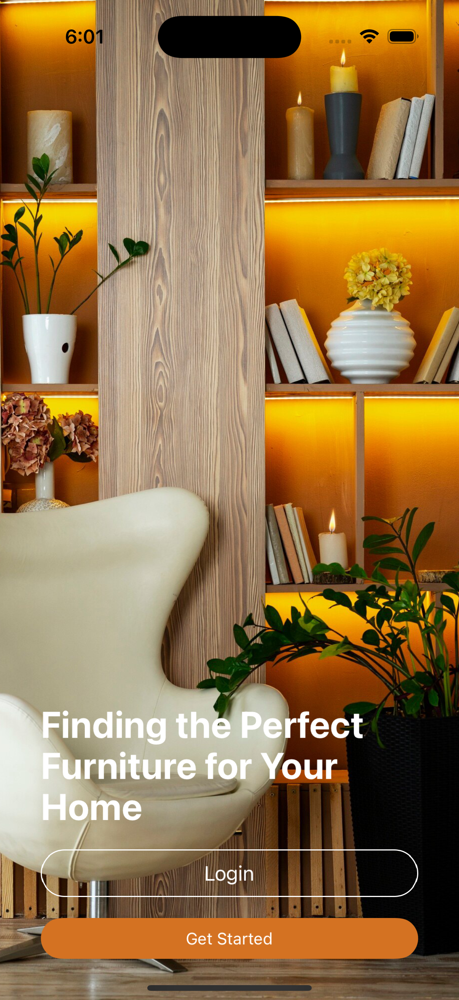

# 🛋️ Furnil Store - Mobile App

A modern furniture shopping experience built with React Native and Expo. Browse, search, and discover beautiful furniture pieces for your home.

## 📱 Features

- **Browse Furniture**: Explore a wide range of furniture categories
- **Product Details**: View detailed product information, materials, and pricing
- **Search & Filter**: Find exactly what you're looking for
- **Shopping Cart**: Easy-to-use cart functionality
- **Clean UI**: Modern, minimalist design with smooth animations
- **Responsive Layout**: Optimized for various screen sizes

## 🛠️ Tech Stack

- **Framework**: [React Native](https://reactnative.dev/) with [Expo](https://expo.dev/)
- **Styling**: [NativeWind](https://www.nativewind.dev/) (Tailwind CSS for React Native)
- **State Management**: [TanStack Query](https://tanstack.com/query/latest) (formerly React Query)
- **API Client**: [Axios](https://axios-http.com/)
- **Backend**: [MockAPI](https://mockapi.io/) for rapid prototyping
- **Navigation**: [Expo Router](https://docs.expo.dev/routing/introduction/)

## 📋 Prerequisites

Before you begin, ensure you have the following installed:
- [Node.js](https://nodejs.org/) (v16 or later)
- [Expo CLI](https://docs.expo.dev/get-started/installation/)
- [Git](https://git-scm.com/)

## 🚀 Getting Started

1. **Clone the repository**
```bash
git clone https://github.com/yourusername/furnil-store.git
cd furnil-store
```

2. **Install dependencies**
```bash
npm install
```

3. **Set up environment variables**
```bash
cp .env.example .env
```
Update the `.env` file with your MockAPI credentials and other configuration.

4. **Start the development server**
```bash
npx expo start
```

## 📁 Project Structure

```
furnil-store/
├── app/                    # Expo Router pages
├── assets/                 # Static assets (images, fonts)
├── components/             # Reusable React components
├── hooks/                  # Custom hooks including API queries
├── services/              # API and other external services
├── styles/                # Global styles and theme
└── types/                 # TypeScript type definitions
```

## 🔄 API Integration

The app uses TanStack Query for API state management:

```javascript
// Example product query hook
export const useGetProducts = () => {
  return useQuery({
    queryKey: ['products'],
    queryFn: async () => {
      const response = await axios.get('/products');
      return response.data;
    }
  });
};
```

## 🎨 Styling

We use NativeWind (Tailwind CSS) for styling. Example component:

```javascript
function ProductCard({ product }) {
  return (
    <View className="bg-white p-4 rounded-xl shadow-sm">
      <Image
        source={{ uri: product.image }}
        className="w-full h-48 rounded-lg"
      />
      <Text className="text-lg font-medium mt-2">
        {product.name}
      </Text>
    </View>
  );
}
```

## 📱 Screenshots

<div align="center">

## Home Screen & Product Listing
<p float="left">
  

</p>


</div>

## 🧪 Testing

Run the test suite:

```bash
npm test
```

## 📦 Building for Production

1. **Configure app.json**
Update the `app.json` with your app's information.

2. **Build for iOS**
```bash
npx expo build:ios
```

3. **Build for Android**
```bash
npx expo build:android
```